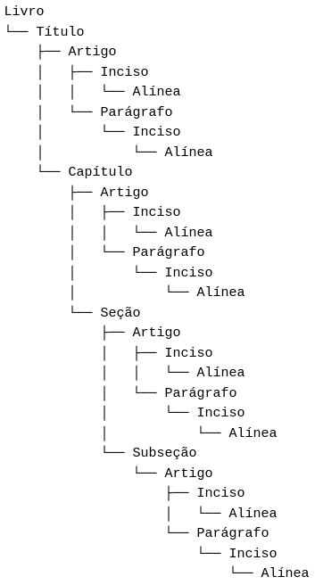
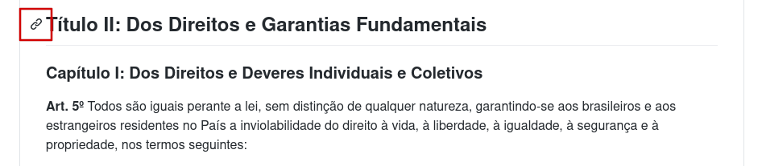
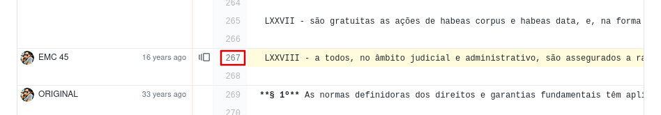
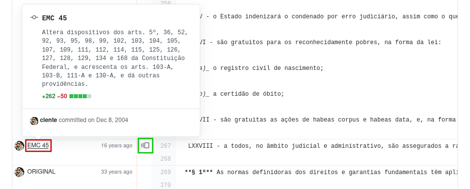
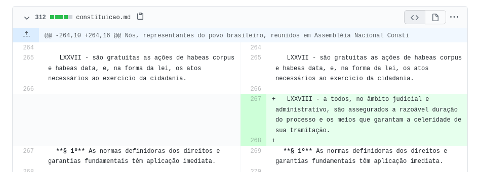
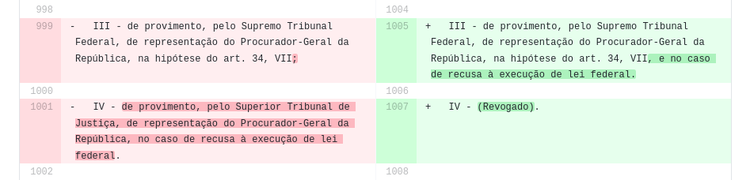
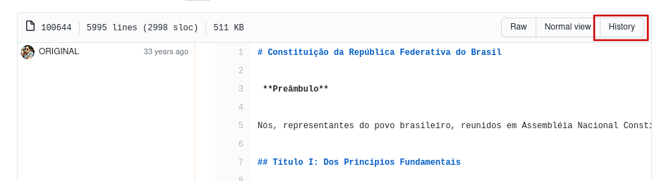
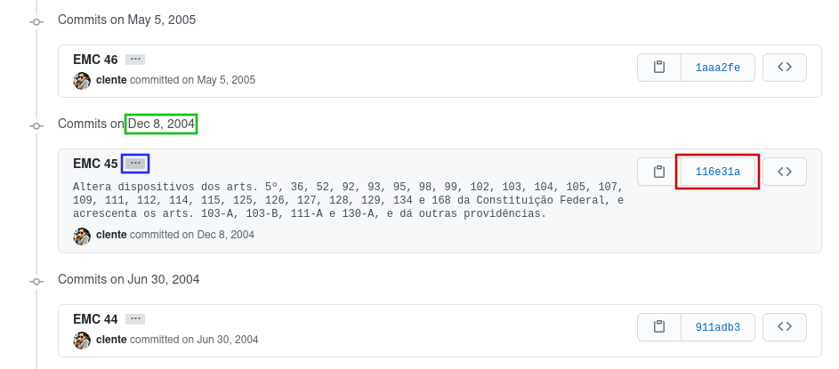

# Explorador da Constituição

A _Constituição da República Federativa do Brasil_ é um documento com mais de
300 artigos, 900 parágrafos e 1.300 incisos, totalizando em torno de 72.000
palavras. Não apenas extensa, a Constituição também é um texto que muda
constantemente: desde a sua promulgação em 1988, ela já sofreu mais de 100
revisões na forma de Emendas Constitucionais e Emendas de Revisão.

O objetivo do
**Explorador da Constituição** é ajudar qualquer um a analisar a nossa Carta
Magna! Abaixo você vai encontrar instruções sobre como funciona este repositório
e informações úteis para explorar as bases de dados aqui disponibilizadas:

- 📚 Sobre a Constituição

  - Emendas

  - Estrutura
  
  - ADCT

- 🔍 Análise manual

  - Blame, diff e history

- 💻 Análise computacional

- 📐 Notas metodológicas

## 📚 Sobre a Constituição

A nossa atual Constituição foi promulgada em 5 de outubro de 1988, após mais de
20 anos de ditadura militar, motivo pelo qual ela é chamada de "Constituição
Cidadã".

Justamente por ser um documento ratificado recentemente, ele ainda está sujeito
a constantes modificações por parte do Legislativo Nacional. Como aludido acima,
o texto encontra-se em sua 117ª versão, tendo passado por 108 Emendas
Constitucionais, seis Emendas de Revisão e dois Atos Internacionais equivalentes
a Emendas.

Após cada Emenda, é gerado um novo texto compilado que passa a ser considerado
a versão mais atual da Carta Magna. Esses textos são
[publicados](https://www.senado.leg.br/atividade/const/constituicao-federal.asp)
pelo Senado Federal e serviram de base para este projeto!

### Emendas

Emendas Constitucionais (EMCs) começam como Propostas de Emenda à Constituição
(PECs), que não passam de sugestões de alteração no seu texto. Se a PEC é
aprovada por três quintos da Câmara dos Deputados e do Senado Federal em dois
turnos de votação, ela se torna uma EMC e suas determinações são incorporadas à
Constituição.

Atos Internacionais equivalentes a Emendas Constitucionais passaram a ser
permitidos a partir da EMC 45, que previa que "tratados e convenções
internacionais sobre direitos humanos que forem aprovados [como EMCs] serão
equivalentes às emendas constitucionais". As Emendas Constitucionais de Revisão
(EMRs) só puderam ser ratificadas durante a Revisão Constitucional prevista de
1993 e, portanto, não são mais permitidas.

### Estrutura

O texto compilado atual conta com quase 3.000 itens que versam sobre os mais
diversos aspectos da Federação, organizados segundo a hierarquia de qualquer outra
lei: títulos, capítulos, seções, subseções, artigos, parágrafos, incisos e
alíneas.

Os primeiros quatro níveis (títulos,
capítulos, seções, subseções) são apenas separações no texto, delimitando temas
distintos. Nem todos esses níveis são necessários; pode haver títulos sem
capítulos, capítulos sem seções e assim por diante, mas um capítulo sempre faz
parte de um título, uma seção sempre faz parte de um capítulo, etc.

Os outros quatro níveis (artigos, parágrafos, incisos e alíneas) são
genericamente chamados de dispositivos, pois são eles que de fato contêm o texto
da Constituição. Aqui o padrão anterior se repete: por exemplo, um artigo pode
não ter parágrafos, mas um parágrafo sempre faz parte de um artigo. Entretanto
há uma exceção importante: artigos podem ter parágrafos **ou** incisos, mas um
parágrafo também pode ter incisos. Isso pode parecer arbitrário e sem sentido,
mas incisos servem para listar itens, então eles são úteis tanto para artigos
inteiros quanto para parágrafos.



Acima está ilustrada a árvore dos dispositivos da Constituição. Toda norma da
Carta Magna cai em algum lugar da árvore, então ela pode facilitar a compreensão
de como ambos os dispositivos exemplificados a seguir podem fazer parte do mesmo
texto (note os demarcadores pouco usuais: o símbolo "§" para parágrafos,
numerais romanos para incisos e letras seguidas de um parêntese para alíneas):

- `Título I > Art. 2º`

- `Título IV > Capítulo I > Seção VIII > Subseção III > Art. 61 > § 1º > II > b)`

### ADCT

Último título da Carta Magna, o Ato das Disposições Constitucionais Transitórias (ADCT) é
diferente dos outros. Primeiro que ele tem um nome particular, sem numeração, e
segundo que ele reinicia a contagem dos artigos.

O ADCT é uma parte separada
da Constituição que contém normas específicas referentes à transição da ditadura
militar para o novo regime democrático e outros dispositivos com escopo temporal
limitado. Mas não é por ser diferente que o ADCT tem menos valor; os seus
artigos têm o mesmo peso legal que os artigos do resto da Constituição.

## 🔍 Análise manual

Caso você queira entender como a Constituição mudou com o tempo ou
explorar a sua estrutura atual, este repositório é um ótimo recurso. Para os
iniciantes, a recomendação é começar pela seção acima, pois a estrutura da nossa
Lei Maior não é tão simples.

O primeiro passo para utilizar o Explorador da Constituição é clicar no arquivo
[`CONSTITUICAO.md`](CONSTITUICAO.md) acima e ser levado ao texto completo
atualizado. Lá, é possível ler a Constituição, utilizar CTRL+F no
seu navegador para procurar excertos e copiar links para trechos do arquivo
clicando nos elos ao lado de cada cabeçalho.



### Blame, diff e history

No topo da página, está o acesso a uma das ferramentas mais úteis
para entender a Constituição ao longo do tempo: o _blame_ (também disponível
diretamente através de
[um link](https://github.com/abjur/constituicao/blame/main/CONSTITUICAO.md)).
Esse é um termo computacional que não importa no momento, basta apenas saber que
ele traz a última versão na qual cada linha do arquivo foi alterada.

Na imagem abaixo está o blame do inciso LXXVIII do Art. 5º. Como é possível ver,
a coluna da esquerda indica que ele foi modificado pela última vez 16 anos
atrás, na EMC 45. Clicando no número da linha (retângulo vermelho), é gerado um
link direto para esse dispositivo.



Ainda nesta visão, ao passar o mouse pelo número da EMC (retângulo vermelho na
imagem abaixo), é exibida a ementa daquela Emenda. Um clique no ícone destacado
pelo quadrado verde nos leva para o blame do texto
compilado da Constituição em 8 de dezembro de 2004. A próxima ferramenta
relevante do Explorador, por sua vez, pode ser acessada clicando no próprio
número da EMC.



Este é o _diff_, outro tempo técnico irrelevante agora. Na esquerda está
representada o texto da Constituição antes da EMC de interesse (a 45 nesse
caso) e, na direita, o texto após a Emenda. A representação das modificações
são bastante intuitivas de modo que, na figura abaixo, é possível perceber que o
inciso LXXVIII foi incluído na constituição pela EMC 45.



Ainda neste mesmo exemplo, um pouco mais abaixo na página está o trecho
ilustrado a seguir. Grifos em vermelho representam trechos suprimidos da
Constituição pela EMC, enquanto os verdes destacam trechos adicionados pela mesma.



A última ferramenta para a análise manual da Constituição pode ser encontrada na
[página do blame](https://github.com/abjur/constituicao/blame/main/CONSTITUICAO.md):
a _history_ (também disponível diretamente através de
[um link](https://github.com/abjur/constituicao/commits/main/CONSTITUICAO.md)).



Essa página contém o histórico com todas as Emendas Constitucionais aprovadas
pelo Legislativo ao longo dos anos. Se voltarmos o suficiente no passado,
é possível encontrar mais uma vez a nossa EMC de interesse para este tutorial,
ilustrada abaixo.

Destacada em verde está a data de aprovação da EMC. Clicando nas reticências
circunscritas pelo retângulo azul, a ementa da Emenda é exibida novamente. Por
fim, o botão destacado em vermelho leva o Explorador de volta no tempo, para a
data daquela EMC, onde é possível utilizar todas as ferramentas destacadas no
tutorial, mas em uma versão antiga da Constituição.



## 💻 Análise computacional

Esta seção do manual do Explorador da Constituição é voltada para os
programadores que querem utilizar os recursos mais avançados deste repositório.
Se você entende das funcionalidades principais do git/GitHub, como o blame, o
diff e o histórico de commits, então não é necessário ler a seção anterior.

Todas as pastas em caixa-alta contêm dados que podem ser úteis para análises da
constituição. Cada arquivo desses diretórios é nomeado em referência a uma EMC e
e à data na qual ela foi aprovada e contém os dados do texto
compilado da Constituição após a alterações daquela Emenda.

A pasta `HTML/` tem os arquivos HTML crus
[disponibilizados](https://www.senado.leg.br/atividade/const/constituicao-federal.asp)
pelo Senado Federal em seu site que foram utilizados para gerar os outros dados
e o arquivo markdown [`CONSTITUICAO.md`](CONSTITUICAO.md). A pasta `CSV/`
possui, na mesma estrutura de arquivos, arquivos CSV em que cada linha
representa um dispositivo da Constituição e a sua posição dentro do texto. Por
fim, a pasta `JSON/` contém arquivos JSON com a Constituição em forma de lista.

Abaixo há um exemplo em R de como acessar os incisos do Art. 1º. Note que
**todas** as colunas do arquivo CSV devem ser lidas como strings; isso ocorre
porque certos dispositivos são distinguidos com letras maiúsculas como, por
exemplo, o Art. 146-A.

```r
library(tidyverse)
library(jsonlite)

"CSV/20200826_EMC108.csv" %>%
  read_csv(col_types = cols(.default = "c")) %>%
  filter(titulo == "1", artigo == "1", !is.na(inciso))
#> # A tibble: 5 x 10
#>   classe texto     titulo capitulo secao subsecao artigo paragrafo inciso alinea
#>   <chr>  <chr>     <chr>  <chr>    <chr> <chr>    <chr>  <chr>     <chr>  <chr> 
#> 1 inciso I - a so… 1      <NA>     <NA>  <NA>     1      <NA>      1      <NA>  
#> 2 inciso II - a c… 1      <NA>     <NA>  <NA>     1      <NA>      2      <NA>  
#> 3 inciso III - a … 1      <NA>     <NA>  <NA>     1      <NA>      3      <NA>  
#> 4 inciso IV - os … 1      <NA>     <NA>  <NA>     1      <NA>      4      <NA>  
#> 5 inciso V - o pl… 1      <NA>     <NA>  <NA>     1      <NA>      5      <NA>

"JSON/20200826_EMC108.json" %>%
  read_json() %>%
  pluck("titulos", "1", "artigos", "1", "incisos") %>%
  map(pluck, "texto", 1)
#> $`1`
#> [1] "I - a soberania;"
#> 
#> $`2`
#> [1] "II - a cidadania;"
#> 
#> $`3`
#> [1] "III - a dignidade da pessoa humana;"
#> 
#> $`4`
#> [1] "IV - os valores sociais do trabalho e da livre iniciativa;"
#> 
#> $`5`
#> [1] "V - o pluralismo político."
```

O último recurso útil para um programador é o próprio arquivo
[`CONSTITUICAO.md`](CONSTITUICAO.md). Ele é completamente versionado e as datas
dos commits correspondem à aprovação das Emendas, então é possível fazer uma
análise temporal do texto sem precisar abrir uma série de tabelas ou listas.

O código utilizado para gerar todos os arquivos disponibilizados está em 
[`fonte.R`](fonte.R), assim como os comandos git que permitem fazer o commit de
cada versão do [`CONSTITUICAO.md`](CONSTITUICAO.md) aparecer na data em que a
EMC foi aprovada. É um truque interessante, mas difícil de manter no longo prazo.

## 📐 Notas metodológicas

**Por que algumas EMCs aparecem agrupadas (por exemplo, `EMC 94, EMC 95`)?**

Algumas Emendas Constitucionais foram aprovadas no mesmo dia, então o Senado
Federal disponibiliza somente o texto compilado após a aplicação de **todas**
aquelas EMCs.

**Por que algumas EMCs não apresentam diff (por exemplo, `EMC 107`)?**

Algumas Emendas Constitucionais criam artigos próprios, que não alteram o
texto-base da Constituição. Isso quer dizer que as EMCs 79, 91, 98, 106 e 107
não terão um diff no Explorador.
